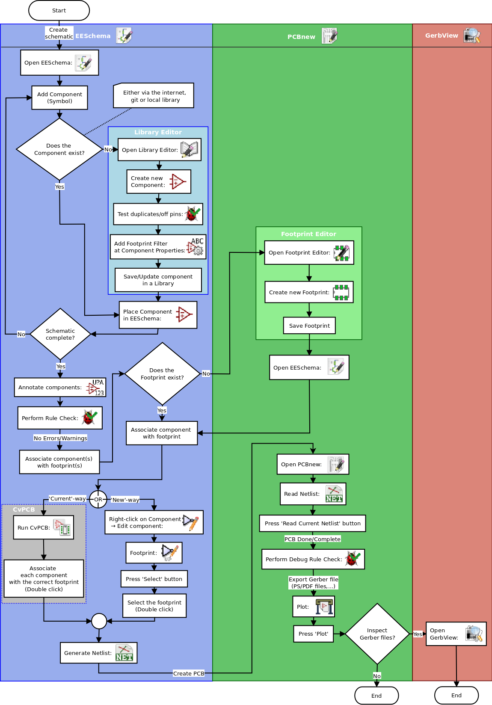

# Guide d'utilisation de Kicad

## Intro
On parlera ici de l'utilisation de KiCAD spécifique au club. Pour l'utilisation générale, consulte la doc inclue dans KiCAD, dans le menu aide/help. Elle est claire, et très bien complétée sur internet par une série de vidéos produites par [DigiKey](https://www.youtube.com/watch?v=vaCVh2SAZY4&index=9&list=PLEBQazB0HUyR24ckSZ5u05TZHV9khgA1O&t=0s). 

La réalisation d'une carte suit le  indiqué dans la doc de kicad. 

## Ouverture d'une carte
Quand tu souhaites visualiser ou modifier une carte, ouvre (double clic) son fichier projet (.pro) ou ouvre directement son schematic avec kicad. Il se peut que des symboles soient 'cassés' : ils sont remplacés par les points d'interrogation. Dans ce cas, édite les : clic droit -> properties -> edit properties et choisit 'change' sous le champ 'Library Symbol'. Remplace alors le symbole par sa version à jour. Si tu ne le trouve nulle part, vérifie si tu as bien importé les librairies du club, et celles offertes par DigiKey.

## Création d'une carte
Lorsque tu dois créer une carte, place la dans le répertoire projects, et nomme-la "\{fonction\}\_\{année\}\_\{microcontrôleur\}". Le fichier projet, schematic et pcb doivent conserver ce nom. Tous les noms doivent être en minuscules, mots_séparés_par_des_underscores (convention snake_case).

## Dessin du schematic

### Préparation
Plusieurs conventions sont à respecter. Dans un premier temps, il faut remplir l'encadré en bas à droite avec l'insertion de texte : 
- Indiquer "club robot", l'année en cours et ton nom dans la zone tout en haut.
- Remplir les champs en gras Titre et Revision (version), plus la date de création. La date sera actualisée à chaque grosse mise à jour.
Chaque fichier et chaque carte doit être tracable en cas de besoin.

### Organisation
La règle d'or lors du dessin d'un schematic est la **lisibilité** ! Comme il ne représente rien en réalité, il faut qu'il soir le plus lisible possible, et le plus facile à modifier !
Deux outils sont indispensables à maitriser (pas de vraie difficulté) : 

#### "Place graphic lines or polygons"
Il te permet d'encadrer chaque partie de ton circuit. On cherche en général à l'organiser (donc diviser) en fonctions élémentaires. Par exemple, tous les connecteurs de puissance seront à un endroit, toutes les led dans un autre, le microcontroleur sera au centre etc... Chaqun de ces bloc-fonction doit être encadré et nommé avec l'outil "Place text".

#### "Place net label"
Il est l'heure de te présenter ton nouvel outil favori. Petit retour théorique : le potentiel électrique (tension par rapport à la masse, ou 'altitude electrique') est le même le long d'un fil. C'est toujours valable si deux fils sont connectés ! Ils forment alors un **noeud** (de fils), ou **net** en anglais. On comprend alors que le potentiel electrique est le même partout sur un noeud donné ! L'équivalent **noeud <=> potentiel** nous permet de nommer une connexion entre plusieurs parties du circuit : c'est le **net label**. L'opportunité est fantasique : tu n'as plus besoin de connecter des composants avec des fils (ce sera brouillon rapidement), mais tu peux placer un **net label** (appelé label par abus de language) sur chaque pin à connecter, et ce peu importe leur nombre ! Cet outil nous permet de rendre invisible les fils entre les différents blocs : le schematic devient beaucoup plus clair ! 

## Routage du PCB

### Type de carte
Pour commencer, il faut savoir ce que tu es en train de faire. Si tu est en train de créer une carte pas très compliquée, ce sera une *'simple face'*, sinon nous travaillerons en *'double face'*. La différence est qu'en double face tu pourras placer beaucoup plus de pistes qu'en simple face. Les faces sur lesquelles nous travailleront sont judicieusement nommées Top et Bottom, donc recto et verso. 

Deux rappels avant de commencer à dessiner : 
- Deux pistes sur une même face ne peuvent pas se croiser
- Les composants traversants ne sont jamais du même côté que les pistes auxquelles ils sont connectés, sinon ils seront impossibles à souder !

### Placement des composants
Avant de connecter les composants, il faut les placer (*duh*). Il n'y a pas de règle générale pour t'aider. Ca se fait très empiriquement. On commence au moins par placer les connecteurs sur les bords de la carte. Dans la mesure du possible, il vaut mieux n'utiliser que deux arrêtes opposées. Tout sera plus simple pendant le câblage.

### Préparation des **Design Rules**
Il va falloir bien suivre, la suite est très importante et te fera gagner *beaucoup* de temps. Un peu de contexte : plus une piste est large, plus elle peut conduire du courant sans chauffer. Une piste qui chauffe, ca veut dire des soudures qui fondent ou des composants qui grillent. Mais plus une piste est large, plus le routage sera difficile. Le nouveau jeu est donc de dimensionner chaque piste en fonction de son utilisation : pistes fines pour du signal, pistes larges pour la puissance.
Pour cela, la solution idéale serait justement de pouvoir indiquer à KiCAD quelles connexions seront utilisées pour de la logique, et quelles connexions feront passer des gros courants. Ca tombe bien ! *Setup -> Design rules...* à été inventé pour ca. C'est un processus en deux étapes. 
D'abord on remplit le tableau 'Net classes'. On indique à KiCAD la liste des différents types de connexion. En reprenant l'exemple ci-dessus, on peut y ajouter une classe 'logique' et une classe 'puissance'. Pour le moment, deux classes ne se distingueront que par la caractéritique **'Track width'**, c'est à dire la largeur de la piste. Pour la logique (<300mA), rentrer **0.25mm**. Pour la puissance, on prendra en général **1mm**, mais c'est au cas par cas. Une piste qui alimente une STM32 (<1A) est plus fine qu'une qui alimente un moteur (plusieurs A). 
