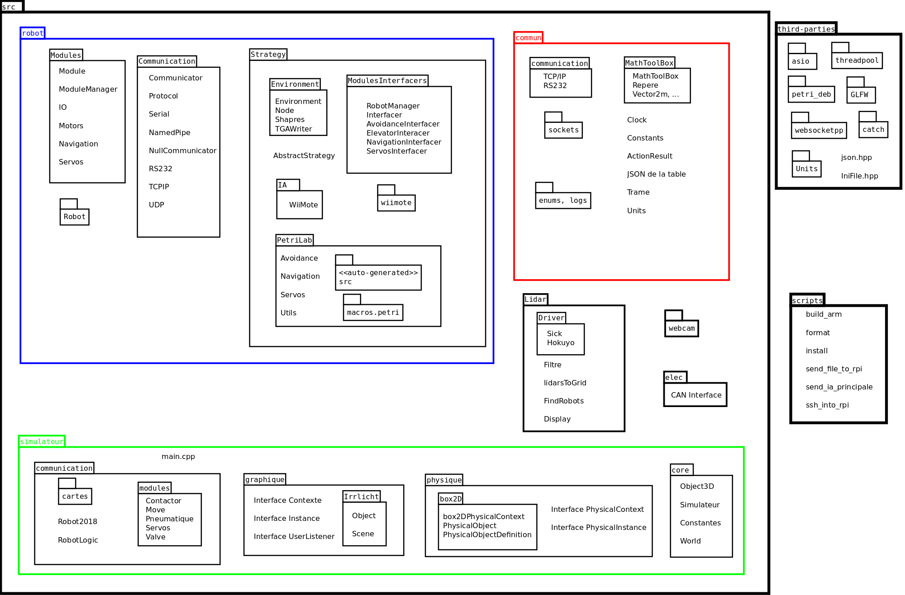

# Vue globale du projet

En étant à la racine du dossier, je t'invite à exécuter ces deux commandes :

```bash
$ find src -type f | wc -l
678

$ find src -type f | xargs wc -l
186823 total
```

Il y a actuellement 678 fichiers source pour presque 200.000 lignes de code ; je te l'accorde c'est beaucoup.

Bien sûr, tous ces fichiers sont structurés et ce petit schéma peut te donner une idée des merveilles que tu peux trouver dans le dossier `src/` :



Bien entendu, ce fichier est à mettre à jour en fonction des nouvelles fonctionnalités apportées, et si tu veux y participer il faut utiliser le logiciel [dia](https://wiki.gnome.org/Apps/Dia/).
```
sudo apt-get install dia
```

Comme tu peux t'en appercevoir, il y a trois parties principales :
* [```commun```](https://github.com/ClubRobotInsat/info/tree/master/src/commun/) - Tu peux y retrouver plein d'outils qui facilitent la programmation (manipulation d'unités physiques, constantes, manipulation de la communication, ...). Ce dossier est hyper important, mais je te conseille dans un premier temps d'utiliser les outils pour travailler sur le reste avant de te plonger dans ces librairies (certaines notions sont un peu compliquées et tout ce code n'est pas forcément directement lié à la robotique).
* [```simulateur/```](https://github.com/ClubRobotInsat/info/tree/master/src/simulateur/) - Ce dossier regroupe l'ensemble des fichiers nécessaires pour mettre au point un simulateur graphique qui nous permets de tester la stratégie du robot avant de l'avoir en vrai, mécaniquement parlant.
* [```robot/```](https://github.com/ClubRobotInsat/info/tree/master/src/robot/) - Il y a toute la stratégie, les interfaces de manipulation des actionneurs, ... Si tu te demandes pourquoi il y a un dossier [```Principal/```](https://github.com/ClubRobotInsat/info/tree/master/src/robot/Principal), c'est parce qu'historiquement le petit et le gros robot étaient définis informatiquement dans le dossier [```robot/```](https://github.com/ClubRobotInsat/info/tree/master/src/robot/), et leur stratégie était bien sûr différents. Il ne reste actuellement que les vestiges du gros robot, car en 2016 on a essayé une autre technologie ([Lego Mindstorms](https://www.lego.com/fr-fr/mindstorms/)) pour le petit robot.

## Architecture du simulateur

Le simulateur est fait pour être modulaire, , c'est à dire que l'on peut passer d'une solution graphique à une autre et on peut rajouter des cartes pour le robot facilement.

Il y a 4 composantes principales :
* La  [```physique/```](https://github.com/ClubRobotInsat/info/tree/master/src/simulateur/physique/) permets de simuler le comportement de tous les objets physiquement en prenant en compte les collisions, les déplacements etc. Pour ce faire, on utilise la librairie [Box2D](http://box2d.org/), on moteur physique.
* Le  [```graphique/```](https://github.com/ClubRobotInsat/info/tree/master/src/simulateur/graphique/) permets d'afficher tous les objets de la table dans un environnement 3D avec la possibilité de s'y déplacer, de zoomer ... Ici encore, on utilise la librairie [Irrlicht](http://irrlicht.sourceforge.net/) en tant que moteur graphique.
* La [```communication/```](https://github.com/ClubRobotInsat/info/tree/master/src/simulateur/communication/) permets de simuler le comportement des cartes électroniques. On peut donc utiliser la même stratégie en réel et sur le simulateur qui demande au robot d'`avancer` de 10 cm par exemple, et l'application va simuler les actions.
* Le [```core/```](https://github.com/ClubRobotInsat/info/tree/master/src/simulateur/core/) permets enfin de tout coordonner pour avoir un simulateur fonctionnel.

## Présentation des abstraction informatiques autour du robot

En informatique, il y a de nombreuses couches d'abstraction qui séparent les cartes électroniques de l'IA du match. Je te propose un petit aperçu de ces couches, des explications supplémentaires et spécifiques à chaque couche te seront apportées en suivant.

<style type="text/css">
.tg  {border-collapse:collapse;border-spacing:0;border-color:#999;}
.tg td{font-family:Arial, sans-serif;font-size:14px;padding:10px 5px;border-style:solid;border-width:1px;overflow:hidden;word-break:normal;border-color:#999;color:#444;background-color:#F7FDFA;}
.tg th{font-family:Arial, sans-serif;font-size:14px;font-weight:normal;padding:10px 5px;border-style:solid;border-width:1px;overflow:hidden;word-break:normal;border-color:#999;color:#fff;background-color:#26ADE4;}
.tg .tg-uys7{border-color:inherit;text-align:center}
.tg .tg-us36{border-color:inherit;vertical-align:top}
.tg .tg-xrpy{font-weight:bold;font-size:18px;border-color:inherit;text-align:center}
</style>
<table class="tg">
  <tr>
    <th class="tg-xrpy" colspan="5">Couches d'abstraction</th>
    <th class="tg-xrpy">Explications brèves</th>
    <th class="tg-xrpy" colspan="2">Localisation</th>
  </tr>
  <tr>
    <td class="tg-uys7" colspan="5">Petrilab</td>
    <td class="tg-uys7"><span style="font-weight:bold">Interface graphique</span> pour créer les stratégies</td>
    <td class="tg-uys7" colspan="2"><a href="https://github.com/ClubRobotInsat/info/tree/master/src/robot/Principal/petri/">src/robot/Principal/petri/</a></td>
  </tr>
  <tr>
    <td class="tg-uys7">IAPrincipale</td>
    <td class="tg-uys7">IAWiiMote</td>
    <td class="tg-uys7">IATests</td>
    <td class="tg-uys7">IATestLidar</td>
    <td class="tg-uys7">...</td>
    <td class="tg-uys7"><span style="font-weight:bold">Exécution</span> de la <span style="font-weight:bold">stratégie</span> / tests haut niveau</td>
    <td class="tg-uys7" colspan="2"><a href="https://github.com/ClubRobotInsat/info/tree/master/src/robot/Principal/IA/">src/robot/Principal/IA/</a></td>
  </tr>
  <tr>
    <td class="tg-uys7" colspan="2">Stratégie</td>
    <td class="tg-uys7" colspan="3">MecaManager</td>
    <td class="tg-uys7"><span style="font-weight:bold">Couleur</span>, <span style="font-weight:bold">repère</span>, temps, tirette ; fonctions <span style="font-weight:bold">haut niveau</span></td>
    <td class="tg-uys7"><a href="https://github.com/ClubRobotInsat/info/tree/master/src/robot/Principal/librobot/Strategie.h">Strategie.h</a></td>
    <td class="tg-us36"><a href="https://github.com/ClubRobotInsat/info/tree/master/src/robot/Principal/librobot/MecaManager.h">MecaManager.h</a></td>
  </tr>
  <tr>
    <td class="tg-uys7" colspan="5">RobotPrincipal <span style="font-style:italic">(public RobotCommun)</span></td>
    <td class="tg-uys7"><span style="font-weight:bold">Assignation</span> des cartes pour <span style="font-weight:bold">2018</span><br></td>
    <td class="tg-uys7" colspan="2"><a href="https://github.com/ClubRobotInsat/info/tree/master/src/robot/Principal/librobot/Robot.h">src/robot/Principal/librobot/Robot.h</a></td>
  </tr>
  <tr>
    <td class="tg-uys7" colspan="5">RobotCommun <span style="font-style:italic">(virtual)</span></td>
    <td class="tg-uys7"><span style="font-weight:bold">Com'</span>, <span style="font-weight:bold">adversaire</span>, <span style="font-weight:bold">déplacements</span>, cartes</td>
    <td class="tg-uys7" colspan="2"><a href="https://github.com/ClubRobotInsat/info/tree/master/src/robot/Commun/Robot.h">src/robot/Commun/Robot.h</a></td>
  </tr>
  <tr>
    <td class="tg-uys7">Déplacement</td>
    <td class="tg-uys7">Servos</td>
    <td class="tg-uys7">Moteurs<br></td>
    <td class="tg-uys7">Évitement<br></td>
    <td class="tg-uys7">...</td>
    <td class="tg-uys7"><span style="font-weight:bold">Interfaces</span> bloquantes</td>
    <td class="tg-uys7" colspan="2"><a href="https://github.com/ClubRobotInsat/info/tree/master/src/robot/Commun/">src/robot/Commun/</a></td>
  </tr>
  <tr>
    <td class="tg-uys7" colspan="5">Cartes électroniques</td>
    <td class="tg-uys7">Communication par <span style="font-weight:bold">trames</span></td>
    <td class="tg-uys7" colspan="2"><a href="https://github.com/ClubRobotInsat/info/tree/master/src/robot/Cartes/">src/robot/Cartes/</a></td>
  </tr>
</table>
