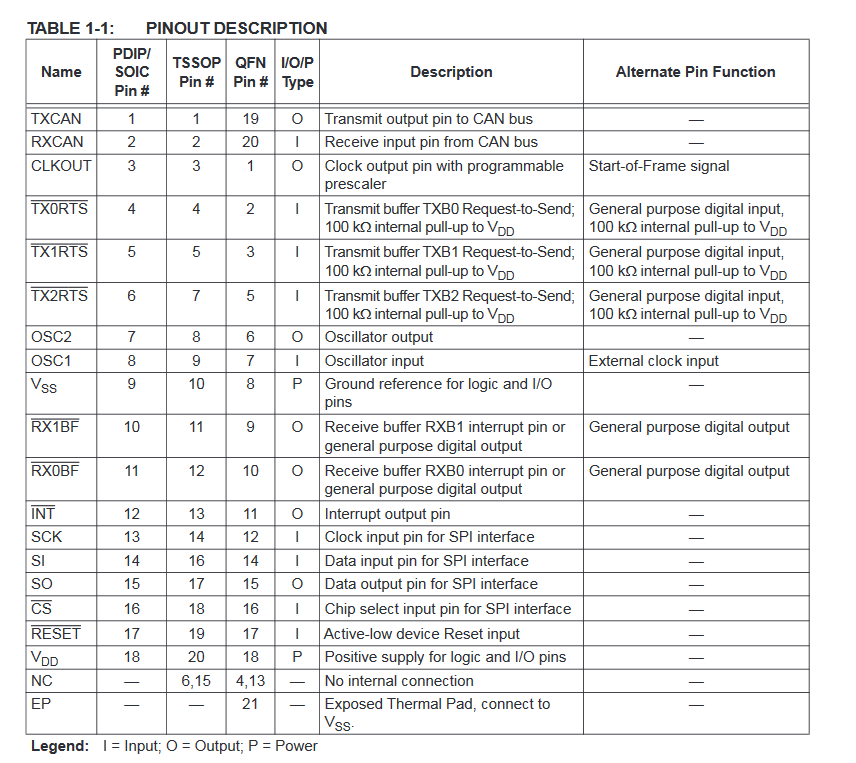
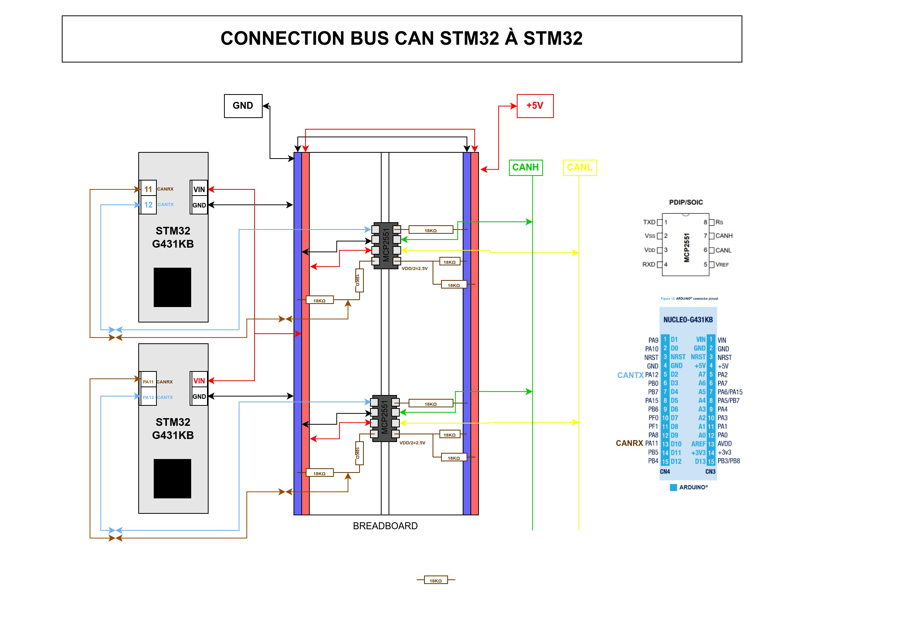

# Communication avec le hardware: CAN Bus

La communication avec le hardware est essentielle pour assurer le bon fonctionnement du robot. Cette section se concentre sur le bus CAN, un choix stratégique en raison de sa robustesse et de sa rapidité.

## Qu'est ce que le Bus CAN ?

Le bus CAN (Controller Area Network) est un bus de communication série largement utilisé dans l'industrie. Il offre une communication rapide et fiable avec plusieurs modules simultanément. Pour en savoir plus sur son fonctionnement, consultez ces documents:
- [Description générale du fonctionnement](https://www.ti.com/lit/an/sloa101b/sloa101b.pdf?ts=1633140726383&ref_url=https%3A%2F%2Fwww.google.com%2F)
- [tutoriel explicatif](https://www.csselectronics.com/pages/can-bus-simple-intro-tutoria).


## Matériel utilisé pour le bus CAN

CAN Transceiver : Composant intermédiaire pour produire les signaux CANL et CANH et les transporter dans le réseau.

On utilise 2 modèles. On utilise le **MCP2515** et le **MCP2551**.

Datasheets:
- [Datasheet MCP2551](https://ww1.microchip.com/downloads/en/DeviceDoc/20001667G.pdf)
- [Datasheet MCP2515](https://ww1.microchip.com/downloads/en/DeviceDoc/MCP2515-Stand-Alone-CAN-Controller-with-SPI-20001801J.pdf)

### Différence entre MCP2515 et MCP2551

Le **MCP2515** est un contrôleur CAN qui permet de communiquer avec le bus CAN via SPI. Il est utilisé pour envoyer et recevoir des messages CAN. Il est connecté à la Raspberry Pi via SPI.

Le **MCP2551** est un transceiver CAN plus simple qui permet de convertir les signaux TX et RX en signaux CANH et CANL. Il est compris dans le MCP2515 mais on l'utilise aussi pour communiquer avec la STM32.

## Utilisation du bus CAN

### Paramètres d'alimentation du bus

- Alimentation : **5V**
- Courant : 100mA (en mémoire dans M3)
- Ne pas oublier de mettre un bouchon d'impédance (50 OU 120 Ohm) en fin du cable CAN

### Connexion du MCP2551 (Pour STM32)


**Réglage du slope-rate** :

Pour changer le slope-rate on change la valeur de R connecter sur RS.


### Connexion du MCP2515 (SPI+CAN -> Raspberry Pi)

Connecter les pins du transceiver SI, SO, SCK, INT et CS comme ci dessous. 

:warning: Le VCC doit être sur du **5V** contrairement à ce schéma, ne pas oublier le ground. 




Fichier ```/boot/config.txt``` à mettre pour activer la connexion SPI avec le MCP au moment de boot dans la rpi:
```
# For more options and information see
# http://rptl.io/configtxt
# Some settings may impact device functionality. See link above for details

# Uncomment some or all of these to enable the optional hardware interfaces
#dtparam=i2c_arm=on
#dtparam=i2s=on

dtparam=spi=on

# Enable audio (loads snd_bcm2835)
dtparam=audio=on

# Additional overlays and parameters are documented
# /boot/firmware/overlays/README

# Automatically load overlays for detected cameras
camera_auto_detect=1

# Automatically load overlays for detected DSI displays
display_auto_detect=1

# Automatically load initramfs files, if found
auto_initramfs=1

# Enable DRM VC4 V3D driver
dtoverlay=vc4-kms-v3d
max_framebuffers=2

# Don't have the firmware create an initial video= setting in cmdline.txt.
# Use the kernel's default instead.
disable_fw_kms_setup=1

# Run in 64-bit mode
arm_64bit=1

# Disable compensation for displays with overscan
disable_overscan=1

# Run as fast as firmware / board allows
arm_boost=1

[cm4]
# Enable host mode on the 2711 built-in XHCI USB controller.
# This line should be removed if the legacy DWC2 controller is required
# (e.g. for USB device mode) or if USB support is not required.
otg_mode=1

[all]
dtoverlay=mcp2515-can0,oscillator=16000000,interrupt=25,spimaxfrequency=500000
dtoverlay=spi0-hw-cs

```


### Exemple de connexion entre deux STM32 

⚠️
 Regarder plus en détail la page dédiée à la communication entre STM32 pour plus d'informations.




## Tutoriel pour la mise en place du bus CAN sur la Raspberry Pi

**Liste des étapes à suivre**:

- [ ] Faire le circuit de la figure ci-dessus entre deux STM32
- [ ] S'assurer que le bus CAN marche entre les deux STM32
- [ ] Connecter le MCP2515 à la Raspberry Pi comme sur la figure ci-dessus
- [ ] Installer les paquets nécessaires sur la Raspberry Pi
- [ ] Vérifier que l'interface can0 est bien présente au démarrage de la raspi avec `ifconfig`
- [ ] Vérifier que la Raspberry Pi reçoit bien les messages envoyés par les STM32 et vice-versa

### Liste des potentiels problèmes

- [ ] Vérifier que le bus CAN est bien alimenté (bouton on/off et branchements…)
- [ ] Vérifier que les fils sont bien branchés
- [ ] Vérifier que les résistances de terminaison sont bien présentes
- [ ] Vérifier que les ground sont bien connectés entre eux
- [ ] Vérifier que le montage est correct
- [ ] Vérifier que les STM32 sont bien alimentés
- [ ] Vérifier que les STM32 sont bien programmés pour envoyer et recevoir des messages CAN
- [ ] Vérifier que les signaux TX et RX sont bien connectés aux pins RX et TX des STM32
- [ ] Vérifier que les signaux sont bien présents sur le BUS CAN (oscilloscope ou serial analyzer)
- [ ] Vérifier que les bonnes données sont envoyées et reçues par les STM32
- [ ] Vérifier que les signaux envoyés par les STM32 sont bien reçus par la Raspberry Pi
- [ ] Vérifier que les modules SPI et CAN sont bien activés sur la Raspberry Pi
- [ ] Vérifier que les paquets nécessaires sont bien installés sur la Raspberry Pi
- [ ] Vérifier que l'interface can0 est bien présente au démarrage de la raspi avec `ifconfig`
- [ ] Vérifier que la Raspberry Pi reçoit bien les messages envoyés par les STM32 et vice-versa

## Vérification du bon fonctionnement du bus CAN sur la Raspberry Pi

### Vérification de l'interface can0:

- Vérifier que l’interface can0 est bien présente au démarrage de la raspi avec `ifconfig`
- On peut aussi vérifier dans les messages de démarrage du kernel que tout s’est bien passé avec `dmesg | grep can` et `dmesg | grep mcp`
- Sinon, redémarrer la raspi `sudo reboot`

### Format des messages

- `candump any` pour recevoir (en boucle)
- `cansend can0 000#00.00.00.00.00.00.00.00` pour envoyer (attention, données en hexa).

## Protocole de test de Liam

Le Bus CAN fonctionne, mais comment le tester? 

Tout d'abord, il faut la raspberry pi avec ubuntu ou raspbian installé dessus (soit USB soit carte SD)
Un module qui fait office d'interface CAN est deja connecté à la raspberry pi 

J'utilise une alim (celle de mon telephone, le chargeur) pour alimenter la raspberry. Ensuite j'utilise un cable micro HDMI pour afficher le terminal qu'il me faut pour mettre en place le bus CAN

Lorsque le terminal est activé, apres avoir renseigné le login et mdp (pi et robotcdf respectivement), il faut mettre en place l'interface CAN avec la commande suivante : 
sudo ip link set can0 up type can bitrate 125000 

Le bitrate depend de nous, si on le change il faut s'assurer que les STM32 ont le meme bitrate associé à leurs interfaces CAN.

Lorsque l'interface est UP , on peut brancher CANH et CANL de la raspi a un bus CAN composé de plusieurs STM32.
Nous avons pour l'instant deux cartes , une avec seulement une stm, une autre carte avec une stm et tout ce qu'il faut pour driver les moteurs a courant continu.

Si l'interface n'est pas UP, il faut verifier l'erreur en utilisant la commande dmesg . Dans mon cas, l'erreur etait due aux fils qui étaient de mauvaise qualité et n'interconnectaient pas bien la raspi et le module CAN.

Il est dorenavant possible d'interagir avec le bus CAN en utilisant l'utilitaire can-utils : 

On peut lancer par exemple : candump can0 pour observer le traffic sur le Bus CAN.
cansend can0 013#01.01.01.01.01.01.01.01 par exemple pour envoyer des donnees sur le bus CAN 
( Dans le cas du code que j'ai ecrit sur la stm32, ceci permet d'ordonner à la STM32 d'activer les moteurs )


Le code sur la STM32 utilise un filtre sur l'ID 013 et verifie le contenu du premier octet de la trame CAN. 

En conclusion : Ne pas faire confiance aux breadboards, ni aux fils (jumper wires) qui ne garantissent pas des connexions fiables.
Il faut aussi faire attention quant a la configuration du filtre sur la stm32.
Attention egalement a l'oscillateur utilisé sur la stm32, il faut bien definir l'oscillation sur le bus CAN (Interface FDCAN)

## Documentation diverse

Explorez ces ressources pour une compréhension plus approfondie du bus CAN et de son utilisation.

- [Guide rapide](https://forums.raspberrypi.com/viewtopic.php?t=141052)

- [Adding CAN to the Raspberry PI](https://www.beyondlogic.org/adding-can-controller-area-network-to-the-raspberry-pi/)
- [How to connect Raspberry Pi to CAN bus](https://projects-raspberry.com/how-to-connect-raspberry-pi-to-can-bus/)
- [ Not able to setup can0. - Raspberry Pi Forums](https://forums.raspberrypi.com/viewtopic.php?t=311606)

- [MCP251x failes setup CAN-bus communication with error=110 · Issue #4183 · raspberrypi/linux](https://github.com/raspberrypi/linux/issues/4183)


## Notes
- Description générale du fonctionnement:  [https://www.ti.com/lit/an/sloa101b/sloa101b.pdf?ts=1633140726383&ref_url=https%3A%2F%2Fwww.google.com%2F](https://www.ti.com/lit/an/sloa101b/sloa101b.pdf?ts=1633140726383&ref_url=https%253A%252F%252Fwww.google.com%252F)

si ça marche pas, vérifier qu’il y a bien deux dispositifs sur le bus 

[CAN Bus Explained - A Simple Intro [2022 | The #1 Tutorial]](https://www.csselectronics.com/pages/can-bus-simple-intro-tutorial)

[GitHub - TVAROBOT/STM32: CAN bus on STM32F103C8T6 "Blue pill" uVision and CubeMX](https://github.com/TVAROBOT/STM32)

[CAN Bus](../ToDo%20d9dc46c3b25c4135a14d9b95735317f5/Decide%20communication%20protocol%20d89cb22bfdd24c7198646a51b15ae670/CAN%20Bus%20b5e77c9cfda440c08deaae066f118232.md)

datasheet : [https://ww1.microchip.com/downloads/en/DeviceDoc/MCP2515-Stand-Alone-CAN-Controller-with-SPI-20001801J.pdf](https://ww1.microchip.com/downloads/en/DeviceDoc/MCP2515-Stand-Alone-CAN-Controller-with-SPI-20001801J.pdf)

[[quick-guide] CAN bus on raspberry pi with MCP2515 - Raspberry Pi Forums](https://forums.raspberrypi.com/viewtopic.php?t=141052)


[Adding CAN to the Raspberry PI](https://www.beyondlogic.org/adding-can-controller-area-network-to-the-raspberry-pi/)

[](https://projects-raspberry.com/how-to-connect-raspberry-pi-to-can-bus/)

apparemment c’est un problème de fils, j’ai les mêmes erreurs qu’ici : 

[[SOLVED] Not able to setup can0. - Raspberry Pi Forums](https://forums.raspberrypi.com/viewtopic.php?t=311606)

[MCP251x failes setup CAN-bus communication with error=110 · Issue #4183 · raspberrypi/linux](https://github.com/raspberrypi/linux/issues/4183)

utilisation : cansend can0 <id>#{data}

id sur 3 nombres

[candump(1) - can-utils - Debian testing - Debian Manpages (apt install can-utils)](https://manpages.debian.org/testing/can-utils/candump.1.en.html)

candump any reçoit en boucle 

finalement on va laisser tomber spidev et utiliser bash directement 

librairie python : spidev (jamais utilisé) 

[https://pypi.org/project/spidev/](https://pypi.org/project/spidev/)

[https://www.sigmdel.ca/michel/ha/rpi/dnld/draft_spidev_doc_fr.pdf](https://www.sigmdel.ca/michel/ha/rpi/dnld/draft_spidev_doc_fr.pdf)

[https://raspberrypi-aa.github.io/session3/spi.html](https://raspberrypi-aa.github.io/session3/spi.html)