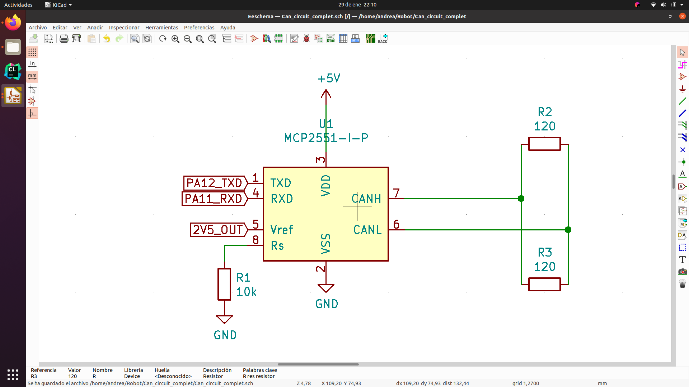
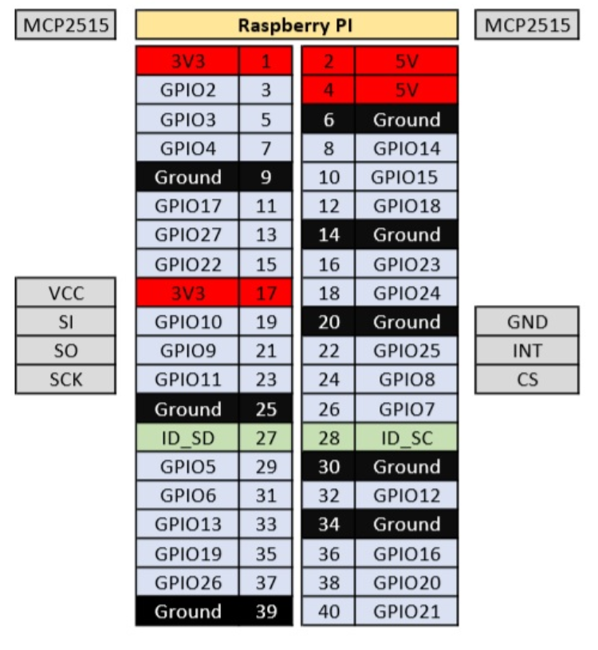

# Communication avec le hardware

## Bus CAN

Le bus CAN est un bus de communication série qui permet de communiquer avec les différents modules du robot. On a choisi ce bus car il est très utilisé dans l'industrie et est donc très robuste. Il est aussi très rapide et permet de communiquer avec plusieurs modules en même temps.

## Ressources de Notion à trier

# CAN Bus

Ressources pour apprendre plus:

- Description générale du fonctionnement:  [https://www.ti.com/lit/an/sloa101b/sloa101b.pdf?ts=1633140726383&ref_url=https%3A%2F%2Fwww.google.com%2F](https://www.ti.com/lit/an/sloa101b/sloa101b.pdf?ts=1633140726383&ref_url=https%253A%252F%252Fwww.google.com%252F)

si ça marche pas, vérifier qu’il y a bien deux dispositifs sur le bus 

[CAN Bus Explained - A Simple Intro [2022 | The #1 Tutorial]](https://www.csselectronics.com/pages/can-bus-simple-intro-tutorial)

[GitHub - TVAROBOT/STM32: CAN bus on STM32F103C8T6 "Blue pill" uVision and CubeMX](https://github.com/TVAROBOT/STM32)

More information: 

[CAN Bus](../ToDo%20d9dc46c3b25c4135a14d9b95735317f5/Decide%20communication%20protocol%20d89cb22bfdd24c7198646a51b15ae670/CAN%20Bus%20b5e77c9cfda440c08deaae066f118232.md)

Ne pas oublier de mettre un bouchon d'impédance (50 OU 120 Ohm) en fin du cable CAN

**PARTIE ÉLÉCTRONIQUE**

CAN transreceiver: Composant intermédiaire pour produire les signaux CANL et CANH et les transporter dans le réseau. Notre modèle est le **MCP2551** 

Pour changer le slope-rate on change la valeur de R connecter sur RS

SI el mensaje no es recibido por una STM32 el envio se bloquea y continua. Establecer un contador/limite maximo de reenvio de mensajes

A hacer:

- [ ]  Reconocer IDs
- [ ]  Interrupción
- [ ]  Prioridad mensajes diferente
- [ ]  Contador máximo para liberar CAN

paramètres alim bus : 5V, 100mA (en mémoire dans M3)

# CAN transreceiver

ALIM EN 5 V 

datasheet : [https://ww1.microchip.com/downloads/en/DeviceDoc/MCP2515-Stand-Alone-CAN-Controller-with-SPI-20001801J.pdf](https://ww1.microchip.com/downloads/en/DeviceDoc/MCP2515-Stand-Alone-CAN-Controller-with-SPI-20001801J.pdf)

ports SPI : SCK = clock

SI =MOSI 

SO = MISO 

CS = SS / CS

# SPI can et transreceiver

# Utilisation :

NE PAS OUBLIER DE CONNECTER LE GROUND DE LA RASPBERRY AU GROUND DU CIRCUIT 

CAN TRANSRECEIVER EN 5V!!

Brancher les pin du transreceiver SI, SO, SCK, INT et CS comme ci dessous 

Le VCC doit être sur du 5V contrairement à ce schéma, ne pas oublier le ground 

Vérifier que l’interface can0 est bien présente au démarrage de la raspi avec ifconfig 

On peut aussi vérifier dans les messages de démarrage du kernel que tout s’est bien passé avec `dmesg | grep can` et `dmesg | grep mcp` 

Sinon, redémarrer la raspi 

SInon, vérifier que le can est bien alimenté (bouton on/off et branchements…) 

format des messages : 

candump any pour recevoir (en boucle) 

cansend can0 000#00.00.00.00.00.00.00.00 (attention, données en hexa) pour envoyer 

# Doc diverse et variée :

[[quick-guide] CAN bus on raspberry pi with MCP2515 - Raspberry Pi Forums](https://forums.raspberrypi.com/viewtopic.php?t=141052)

j’ai essayé de suivre ça, mais ce fut un échec (can-utils) 

fonctionne!! interface can0 dans le fichier de configuration : se met en place au démarrage 

[Adding CAN to the Raspberry PI](https://www.beyondlogic.org/adding-can-controller-area-network-to-the-raspberry-pi/)

apparemment c’est un problème de fils, j’ai les mêmes erreurs qu’ici : 

[[SOLVED] Not able to setup can0. - Raspberry Pi Forums](https://forums.raspberrypi.com/viewtopic.php?t=311606)

[MCP251x failes setup CAN-bus communication with error=110 · Issue #4183 · raspberrypi/linux](https://github.com/raspberrypi/linux/issues/4183)

utilisation : cansend can0 <id>#{data}

id sur 3 nombres

[candump(1) - can-utils - Debian testing - Debian Manpages](https://manpages.debian.org/testing/can-utils/candump.1.en.html)

candump any reçoit en boucle 

finalement on va laisser tomber spidev et utiliser bash directement 

librairie python : spidev (jamais utilisé) 

[https://pypi.org/project/spidev/](https://pypi.org/project/spidev/)

[https://www.sigmdel.ca/michel/ha/rpi/dnld/draft_spidev_doc_fr.pdf](https://www.sigmdel.ca/michel/ha/rpi/dnld/draft_spidev_doc_fr.pdf)

[https://raspberrypi-aa.github.io/session3/spi.html](https://raspberrypi-aa.github.io/session3/spi.html)