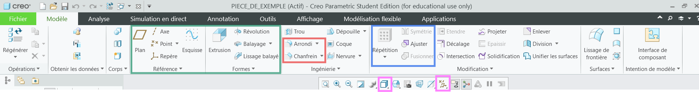

# Les fonctions principales à connaitre pour l'utilisation de Creo 9
## Intorduction
Creo Parametric est un logiciel de CAD (Computer-aided design) d'entrée de gamme, c'est-à-dire qu'il est moins intuitif que ses collègues (ex. SolidWorks et Catia), mais la licence de Creo coûte moins cher et, ce qui est important, est fournie par notre école, INSA Toulouse. C'est pourquoi au Club Robot, on utilise Creo. Pour savoir comment installer et configurer Creo 9 avec le compte INSA, voir le document : [Instalation de Creo](installation-de-creo.md).  
## Partie 1) Repertoire de travail
La première chose à faire chaque fois que vous lancez votre Creo, c'est le choix du répertoire de travail, c'est-à-dire, vous devez lui indiquer manuellement l'emplacement de votre projet sur votre ordinateur, sinon il ne pourra pas travailler avec les assemblages. C'est une fonction assez pratique car elle permet de ne pas mélanger vos projets et fichiers si vous travaillez sur plusieurs sujets en parallèle.
Pour cela un fois le Creo sera lancée, fermez le pub (oui c'est un popup automatique qui va sauter devant vous tout le temps) et cliquez sur le bouton "Sélectionner le répertoire de travail". Comme dans indiqué sur l'image : 

  

  

Petit conseil : ne mettez pas vos projets sur le bureau, car avec l'accumulation de fichiers, cela peut ralentir le démarrage de l'ordinateur. Rangez-les quelque part dans vos Documents, en traçant bien à quelle année scolaire cela correspond pour vous faciliter l'accès. Exemple : 

  

 
  

 

## Partie 2) Création de pièce et ouverture d'une existante
Maintenant, quand Creo a compris où nous allons stocker nos fichiers, nous allons créer une pièce. Il faut appuyer sur "Nouveau" en haut à gauche, et vous allez voir la fenêtre suivante :
  

  
On laisse les selections de "pièce", "solide" sans modifications et dans "Nom du ficher" on écrit le nom de notre prècieuse pièce.

 
 

**ATTENTION !!!** Quand vous allez nommer vos fichiers, il va falloir faire l'effort de les rendre intuitifs, et pas de "pièce123" ou des choses de ce genre. N'hésitez pas à donner des noms longs, séparés par des "_", qui seront utiles lors de la gestion de l'assemblage. Ex. "connecteur_moteur_makeblock", "support_bras", "profile_alu_90mm" etc.

 

Une fois le fichier créé, il faut l'enregistrer. Il faut cliquer sur "fichier" en haut à gauche, puis sur "enregistrer" ou simplement faire "ctrl + s" (à favoriser car c'est simplement plus pratique). Normalement il va vous mettre automatiquement dans votre répertoire de travail. 
Maintenant, pour ouvrir une autre ficher, dans la même destination : "fichier" on click "ouvrir" et on choisit le ficher dans la liste. 

Comme montré dans l'image : 
 

  

## Partie 3) L'Interface de Creo

Ici, je vais donner la liste et l'emplacement dans Creo 9 des fonctions importantes à connaître et que l'on utilise le plus. Même si vous allez voir pas mal de critiques envers Creo dans ce guide, il faut quand même admettre que ce logiciel de CAO a beaucoup de fonctions et permet aux personnes qui le maîtrisent entièrement de réaliser de véritables chefs-d'œuvre. Mais pour être honnête, personne n'a envie de découvrir autant Creo (y compris moi). C'est pourquoi vous aurez les fonctions strictement nécessaires à notre niveau (c'est-à-dire pas d'étude de résistance et d'élasticité des matériaux, de propriétés aérodynamiques de nos pièces et encore moins des sculptures de type Blender, car ce n'est pas vraiment utile pour notre projet).

### a) L'Arbre de navigation 
L'Arbre de navigation se trouve à notre gauche, comme dans l'image : 
 

  
Ici, on va retrouver les noms de toutes les opérations et fonctions appliquées sur la pièce, ou la liste de toutes les pièces dans les assemblages. L'Arbre de navigation est manipulable, c'est une sorte de trace de vos fonctions que vous pouvez manipuler et l'application va tout recalculer. Vous pouvez bouger la ligne verte afin de masquer les dernières modifications et de "revenir dans le temps". C'est utile quand vous voulez ajouter des modifications post factum sans tout refaire.
On va s'en servir également quand il faudra choisir un élément de la pièce ou de l'assemblage (ex. plans, axes, origines, sous-assemblages, etc.).
Dans une ficher vide, on a quand même notre origine et les plans de Right (vue de profile), Top (vue de dessus) et Front (vue de face) qui sont la base de notre pièce ou de l'assemblage.
### b) Modèle
Dans la partie modèle, on a nos fonctionnalités clés, qui sont entourées dans l'image :

 

  

**Surlignées en Vert :**
  - Plans : permet de créer des plans quelconques, quand l'orientation ou l'emplacement des plans de base ne suffisent pas
  - Axe : permet de créer des axes, pour faire des rotations ou des alignements autour de ces axes
  - Esquisse : faire une esquisse sur un plan pour ensuite ajouter ou enlever de la matière suivant cette esquisse (la base de la base !)
  - Extrusion et Révolution : des fonctions jumelles qui rendent nos esquisses en 3D, où :
    - L'Extrusion fait cela en projection rectiligne
    - La Révolution le fait en tournant autour d'un axe

**Surlignées en Rouge :**
  - Arrondi et Chanfrein : une autre paire de fonctions de même idée, qui ont pour but principal de rendre notre modèle plus solide, où :
    - Arrondi : comme son nom l'indique, arrondit les angles en y ajoutant (ou en enlevant) de la matière
    - Chanfrein : un peu la même idée que l'arrondi, mais au lieu de quelque chose de rond, on ajoute (ou enlève) un angle plat

**Surlignées en Bleu :**

  - Répétition : sert à répliquer plusieurs fois les autres fonctions (on peut faire des répétitions de tout, même des répétitions de répétitions)
  - Symétrie : sert à simplement faire une réplique en miroir selon un plan (très utile pour les pièces symétriques)

**Surlignées en Violet :**

  - L'Ombrage : rend les pièces mieux visibles, quand vous lancez Creo, il suffit de choisir l'option 2 "L'ombrage avec des arêtes"
  - Affichage : permet de cacher les plans, les axes, les origines et les points ; il va falloir tout cacher pour les grands assemblages, sinon on ne voit rien

