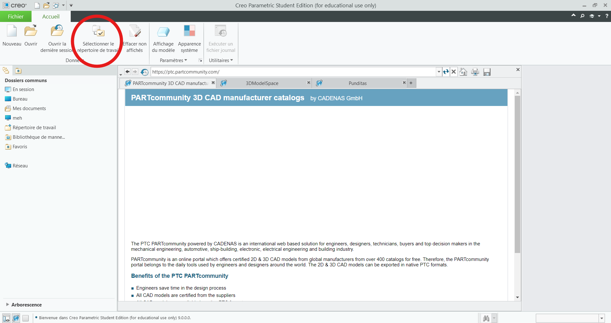
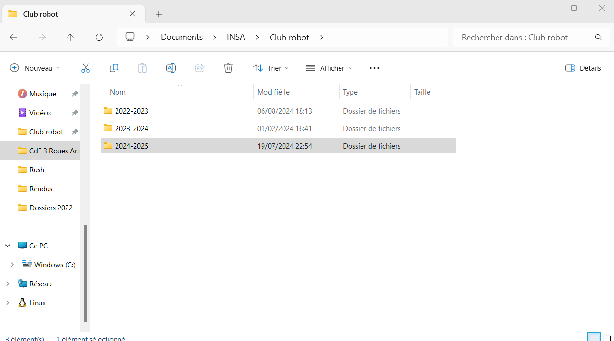
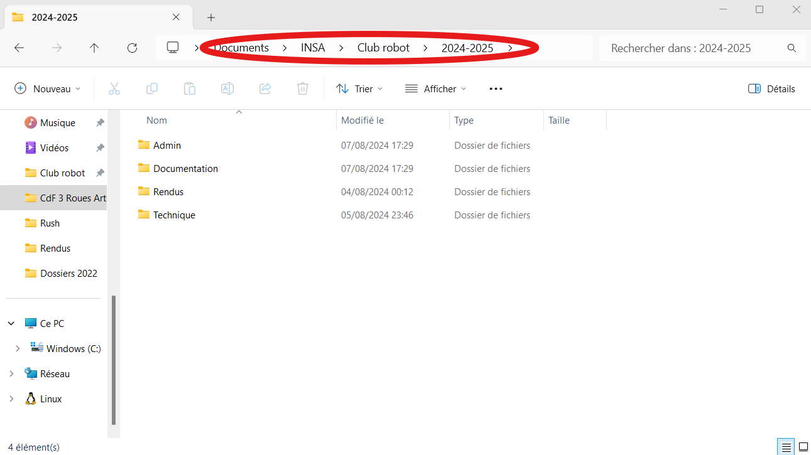
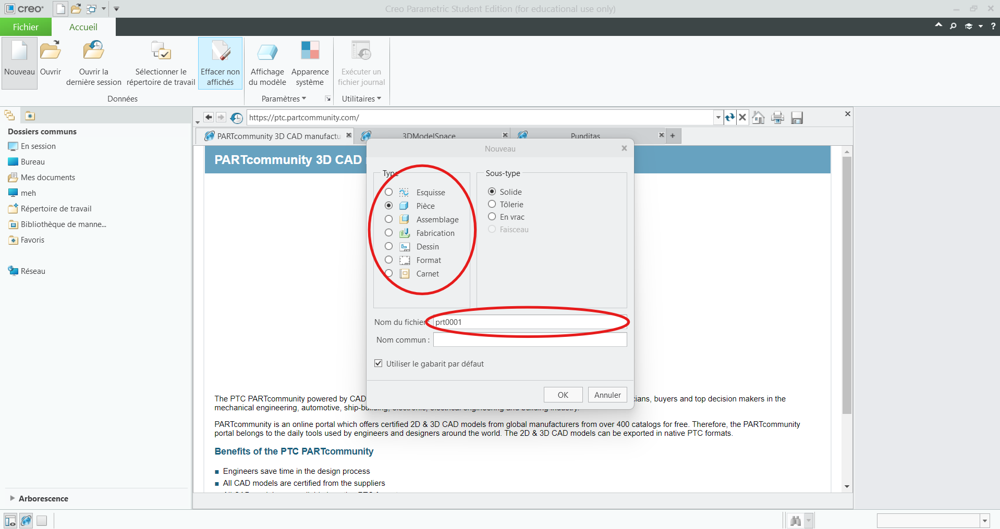
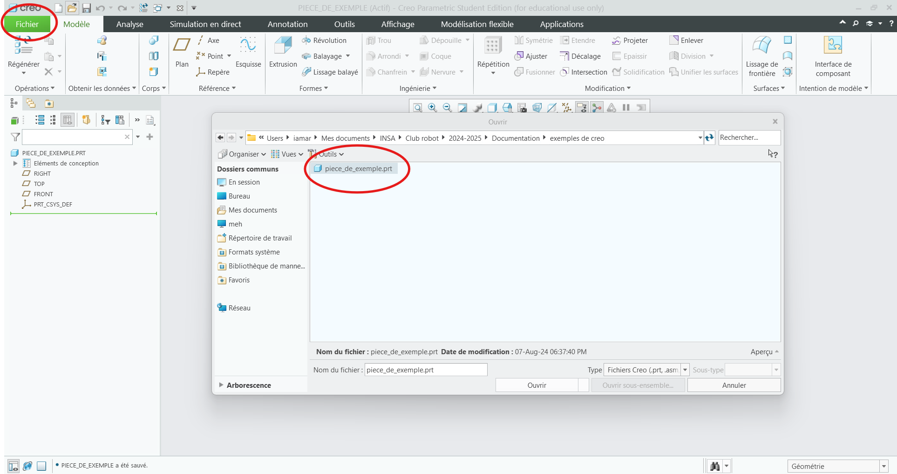
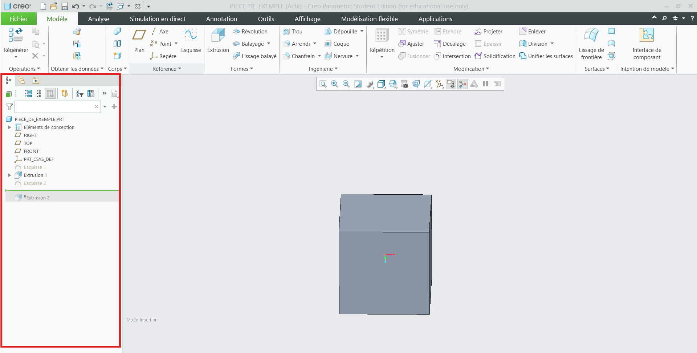

# Les fonctions principales à connaitre pour l'utilisation de Creo 9
## Intorduction
Creo Parametric est un logiciel de CAD (Computer-aided design) d'entrée de gamme, c'est-à-dire qu'il est moins intuitif que ses collègues (ex. SolidWorks et Catia), mais la licence de Creo coûte moins cher et, ce qui est important, est fournie par notre école, INSA Toulouse. C'est pourquoi au Club Robot, on utilise Creo. Pour savoir comment installer et configurer Creo 9 avec le compte INSA, voir le document : [Instalation de Creo](installation-de-creo.md).  
## Partie 1) Repertoire de travail
La première chose à faire chaque fois que vous lancez votre Creo, c'est le choix du répertoire de travail, c'est-à-dire, vous devez lui indiquer manuellement l'emplacement de votre projet sur votre ordinateur, sinon il ne pourra pas travailler avec les assemblages. C'est une fonction assez pratique car elle permet de ne pas mélanger vos projets et fichiers si vous travaillez sur plusieurs sujets en parallèle.
Pour cela un fois le Creo sera lancée, fermez le pub (oui c'est un popup automatique qui va sauter devant vous tout le temps) et cliquez sur le bouton "Sélectionner le répertoire de travail". Comme dans indiqué sur l'image : 

  

  

Petit conseil : ne mettez pas vos projets sur le bureau, car avec l'accumulation de fichiers, cela peut ralentir le démarrage de l'ordinateur. Rangez-les quelque part dans vos Documents, en traçant bien à quelle année scolaire cela correspond pour vous faciliter l'accès. Exemple : 

  

 
  

 

## Partie 2) Création de pièce et ouverture d'une existante
Maintenant, quand Creo a compris où nous allons stocker nos fichiers, nous allons créer une pièce. Il faut appuyer sur "Nouveau" en haut à gauche, et vous allez voir la fenêtre suivante :
  

  
On laisse les selections de "pièce", "solide" sans modifications et dans "Nom du ficher" on écrit le nom de notre prècieuse pièce.

 
 

**ATTENTION !!!** Quand vous allez nommer vos fichiers, il va falloir faire l'effort de les rendre intuitifs, et pas de "pièce123" ou des choses de ce genre. N'hésitez pas à donner des noms longs, séparés par des "_", qui seront utiles lors de la gestion de l'assemblage. Ex. "connecteur_moteur_makeblock", "support_bras", "profile_alu_90mm" etc.

 

Une fois le fichier créé, il faut l'enregistrer. Il faut cliquer sur "fichier" en haut à gauche, puis sur "enregistrer" ou simplement faire "ctrl + s" (à favoriser car c'est simplement plus pratique). Normalement il va vous mettre automatiquement dans votre répertoire de travail. 
Maintenant, pour ouvrir une autre ficher, dans la même destination : "fichier" on click "ouvrir" et on choisit le ficher dans la liste. 

Comme montré dans l'image : 
 

  

## Partie 3) L'Interface de Creo

Dans cette partie, nous allons nous familiariser avec l'interface de Creo et l'emplacement des fonctions dont nous verrons le fonctionnement plus tard.
### a) L'Arbre de navigation 
L'Arbre de navigation se trouve à notre gauche, comme dans l'image : 
 

  
Ici on va retrouver les noms de toutes les opérations et fonctions appliquées sur la pièce ou la liste de toutes les pièces dans les assemblages.
L'Arbre de navigation est manipulable et c'est un sort de trace de vos fonctions que vous pouvez manipuler et l'application vas tout recalculer 

